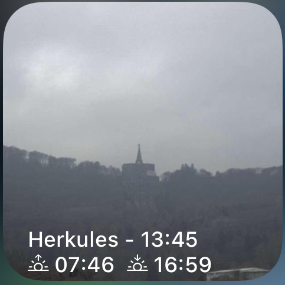
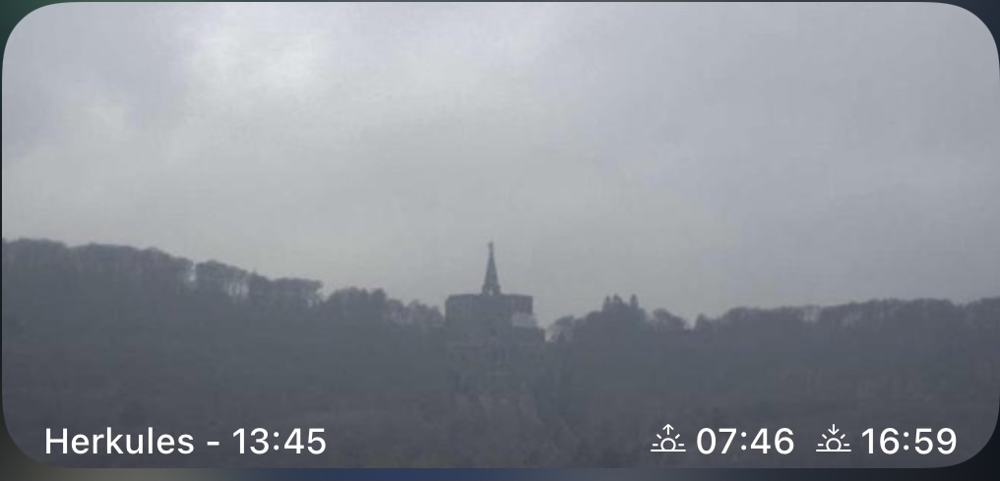

# KSHerkulesWebCam
Zeigt das aktuellste Bild der Webcam der Hessenschau
https://www.hessenschau.de/wetter/wetterkameras/wetterkamera-kassel-herkules-100.html

### Features
- Bilder vor Sonnenaufgang und nach Sonnuntergang werden nicht angezeigt, da die nicht gut aussehen
- Ein Klick auf das Widget führt zur Webseite der WebCam

 

### Konfiguration
Das Widget benötigt keine Konfiguration

### Tipps
Sollen die (hässlichen) Nachtbilder auch angezeigt werden, so kann im Code die Variable onlyDaylightPics = false gesetzt werden.

### Known Bugs

### ChangeLog
- 2020-12-26 initial version
