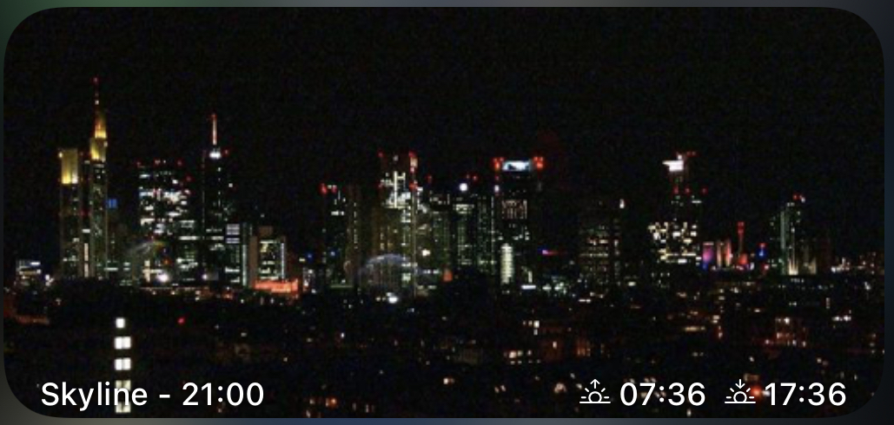
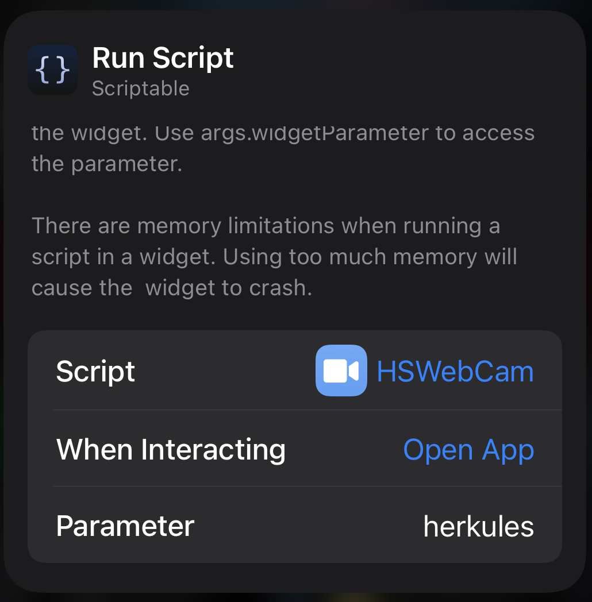

# HSWebCam
Zeigt das aktuellste Bild der Webcam der Hessenschau
z.B.: https://www.hessenschau.de/wetter/wetterkameras/wetterkamera-kassel-herkules-100.html

### Features
- Bilder vor Sonnenaufgang und nach Sonnuntergang ("zivile Dämmerung") werden nicht angezeigt, da die nicht gut aussehen
- Ein Klick auf das Widget führt zur Webseite der WebCam

 

### Konfiguration
Ohne Konfiguration wird die WebCam des Herkules ausgewählt. 
Alternativ können folgende WebCams ausgewählt werden:
- herkules
- karlshafen
- bsa
- darmstadt
- dillenburg
- frankfurt
- fulda
- marburg
- ruedesheim
- edersee
- wasserkuppe
- wiesbaden
- willingen

Der Name wird einfach als Widget-Parameter übergeben.

### Tipps
Nur für Frankfurt werden auch die Nachtbilder angezeigt. Bei allen anderen WebCams sind die Nachtbilder eher hässlich.
Das kann im Code geändert werden. 

### Known Bugs
- Bewusste Abweichung: Die herangezogene "zivile Dämmerung" entspricht nicht den Sonnenuntergangs- und Sonnenaufgangszeiten, die in der Wetter-App vom iPhone angezeigt werden. 

### ChangeLog
- 2020-12-26 initial version
- 2020-12-26 ADD: optimized caching  of image
- 2021-01-08 FIX: don't show pictures older than 24 hours.
- 2021-01-21 ADD: support of all Hessenschau WebCams
- 2022-02-13 FIX: adjusted search-string caused by changed website
